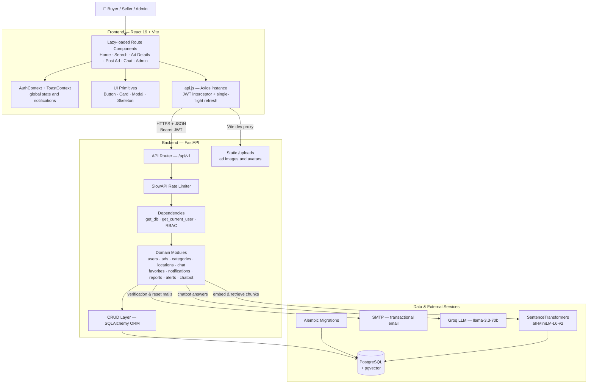

<div align="center">

# 🛒 Marketa

**A full-stack classifieds marketplace — post ads, browse, chat with sellers, and get help from an AI assistant.**


</div>

---

## 📖 Overview

Marketa is an OLX/Quikr-style classifieds platform. Sellers publish ads with images and
category-specific attributes; buyers browse, filter, favourite, and message sellers
directly. An AI chatbot answers product and platform questions using a pgvector-backed
knowledge base, and an admin panel handles categories, locations, reports, FAQs and
enquiries.

The backend is a modular FastAPI service where each domain lives in its own
`app/modules/<entity>/` folder with a consistent `model / schema / crud / endpoint`
layout. The frontend is a React 19 SPA built with Vite and Tailwind CSS.

---

## 🏗️ Architecture & Application Flow



### Request lifecycle

1. The React app attaches the JWT access token from `sessionStorage` to every request via an Axios interceptor.
2. The request hits `/api/v1/<module>/...`, passes the SlowAPI rate limiter, then resolves a database session and the current user through FastAPI dependencies.
3. The module's endpoint validates the payload with a Pydantic schema and delegates to its CRUD layer.
4. Every endpoint answers with the same envelope: `{ "success": bool, "msg": str, "data": any }`.
5. On a `401`, the frontend runs a **single-flight** refresh against `/users/refresh-token/` — parallel requests queue on one refresh promise and retry once it resolves. If the refresh fails, an `auth:forced-logout` event triggers a clean logout.

### Typical user journey

1. A visitor searches by keyword, category, location and category-specific attributes.
2. They open an ad, view images, and save it to favourites or share it.
3. After signing up and verifying their email, they can message the seller in a chat room.
4. A seller posts an ad with images and dynamic attributes, then manages it from **My Ads**.
5. Buyers create search alerts and receive notifications when matching ads appear.
6. Admins moderate reported ads, manage categories, locations, FAQs and the chatbot knowledge base.

---

## ✨ Features

| Area | What's included |
| --- | --- |
| 🔐 **Authentication** | JWT access + refresh tokens, bcrypt hashing, email verification, forgot/reset password, change password, account deletion with confirmation |
| 👥 **Roles** | Super Admin, Admin, User — enforced via role constants and route dependencies |
| 📢 **Ads** | Create, edit, delete, status changes, image uploads, category-specific dynamic attributes, similar-ad suggestions, view counts |
| 🔎 **Search** | Keyword search with category, location and attribute filters |
| ❤️ **Favourites** | Toggle-based saved ads |
| 💬 **Chat** | Per-ad chat rooms, message history, unread counts, seller inquiry inbox |
| 🔔 **Notifications** | In-app notifications with unread counts and read-all |
| 🚨 **Reports** | Users report ads; admins triage and change report status |
| 🤖 **AI Chatbot** | Retrieval-augmented answers over a pgvector knowledge base, powered by Groq |
| 📍 **Locations** | States, cities and popular-city listings with admin CRUD |
| 🛠️ **Admin Panel** | Categories, locations, reports, FAQs, enquiries, knowledge base |
| ♿ **Accessibility** | Skip-to-main link, ARIA on modals and toasts, focus management, keyboard shortcuts |
| ⚡ **Performance** | Route-level code splitting, image lazy-loading with skeletons, `console.*` stripped from production bundles |

---

## 🛠️ Technology Stack

| Layer | Technologies |
| --- | --- |
| **Frontend** | React 19, Vite 8, React Router 7, Tailwind CSS 3, Axios, Lucide React, date-fns |
| **Backend** | Python 3.12+, FastAPI, Uvicorn, Pydantic v2, pydantic-settings |
| **Database** | PostgreSQL with the `pgvector` extension |
| **ORM / Migrations** | SQLAlchemy 2, Alembic |
| **Authentication** | JWT (HS256) via python-jose, bcrypt password hashing |
| **Rate Limiting** | SlowAPI |
| **Email** | SMTP (branded HTML transactional mail) |
| **AI** | Groq (`llama-3.3-70b-versatile`), SentenceTransformers (`all-MiniLM-L6-v2`) |
| **Tooling** | `uv` for Python dependencies, npm for the frontend |

---

## 📁 Repository Structure

```text
marketa/
├── .env.example                        # Environment template — copy to .env
├── .gitignore
├── README.md
├── CLAUDE.md                           # Day-to-day commands & conventions
│
├── backend/                            # FastAPI service
│   ├── main.py                         # Entry point: CORS, rate limiter, static uploads, router
│   ├── common_models.py                # Shared mixin: id, uuid, timestamps, soft delete
│   ├── pyproject.toml                  # Dependency declaration (authoritative)
│   ├── requirements.txt                # pip mirror of pyproject dependencies
│   ├── uv.lock                         # Pinned lock file (committed)
│   ├── alembic.ini                     # Alembic configuration
│   │
│   ├── alembic/
│   │   ├── env.py                      # Migration environment — imports app.db.base
│   │   ├── script.py.mako              # Revision template
│   │   └── versions/                   # 15 migrations, single linear chain
│   │
│   ├── app/
│   │   ├── api/
│   │   │   ├── deps.py                 # get_current_user, role guards
│   │   │   └── v1/api.py               # Aggregates every module router
│   │   ├── core/
│   │   │   ├── config.py               # pydantic-settings Settings, reads root .env
│   │   │   ├── limiter.py              # SlowAPI rate limiter
│   │   │   ├── roles.py                # Role enum + RBAC helpers
│   │   │   └── security.py             # JWT sign/verify, bcrypt hashing
│   │   ├── db/
│   │   │   ├── base.py                 # Model registry for Alembic autogenerate
│   │   │   ├── deps.py                 # get_db session dependency
│   │   │   └── session.py              # Engine + SessionLocal
│   │   ├── modules/                    # One folder per domain, each with
│   │   │   │                           #   model.py · schema.py · crud.py · endpoint.py
│   │   │   ├── ads/                    # Ads, images, category attributes
│   │   │   ├── categories/             # Category tree + attribute definitions
│   │   │   ├── chat/                   # Buyer ↔ seller conversations
│   │   │   ├── chatbot/                # RAG assistant, knowledge_chunks (pgvector)
│   │   │   ├── contact/                # Contact form + FAQs
│   │   │   ├── favorites/              # Saved ads
│   │   │   ├── locations/              # States and cities
│   │   │   ├── notifications/          # In-app notifications
│   │   │   ├── packages/               # Listing package model
│   │   │   ├── recently_viewed/        # Per-user view history
│   │   │   ├── reports/                # Ad abuse reports
│   │   │   ├── reviews/                # Seller review model
│   │   │   ├── search_alerts/          # Saved searches + alerts
│   │   │   └── users/                  # Auth, profile, admin accounts
│   │   └── utils/
│   │       ├── email.py                # SMTP send + HTML templates
│   │       └── logger.py               # Logging setup
│   │
│   ├── knowledge_docs/
│   │   └── marketa_knowledge_base.md   # Source text embedded by the chatbot
│   │
│   ├── seed.py                         # States, cities, categories, attributes
│   ├── seed_category_attributes.py     # Category-specific filters (idempotent)
│   ├── seed_dummy_data.py              # Demo ads, chats, favourites, reviews
│   ├── seed_data.sql                   # Full reset + demo data (destructive)
│   ├── download_seed_images.py         # Fetches demo ad images into uploads/
│   ├── create_admin.py                 # Creates a Super Admin account
│   └── uploads/                        # Runtime upload target (gitignored)
│
├── frontend/                           # React 19 + Vite SPA
│   ├── .env.example
│   ├── index.html                      # Vite HTML entry
│   ├── package.json
│   ├── package-lock.json
│   ├── vite.config.js                  # Dev server :3000, proxies /api and /uploads
│   ├── tailwind.config.js
│   ├── postcss.config.js
│   └── src/
│       ├── main.jsx                    # React root
│       ├── App.jsx                     # Lazy routes inside ErrorBoundary + providers
│       ├── api.js                      # Axios instance, JWT interceptors, refresh flow
│       ├── AuthContext.jsx             # Global auth state, cross-tab sync
│       ├── ToastContext.jsx            # useToast() notifications
│       ├── index.css                   # Tailwind directives + global styles
│       └── components/
│           ├── ui/                     # Button · Card · Input · Modal · Skeleton
│           │                           #   Spinner · EmptyState · ImageWithSkeleton
│           ├── Admin*.jsx              # Admin panel pages
│           └── *.jsx                   # Public and authenticated pages
│
├── claude_skills/                      # AI-assistant project context
│   ├── 00_MASTER_GUIDE.md
│   ├── knowledge/                      # Architecture, schema, tech stack, UI, tests
│   └── skills/                         # API conventions, backend/frontend rules,
│                                       #   design system, security & validation
│
├── knowledge_docs/
│   └── docs/                           # Analysis, implementation plan, demo flow,
│                                       #   presentation overview, test cases
│
└── docs/
    ├── GIT.md                          # Branching and commit workflow
    ├── production_gaps.md              # Known gaps before production
    └── issues.json                     # Issue log
```

---

## 📋 Prerequisites

| Tool | Version | Notes |
| --- | --- | --- |
| **Python** | 3.12+ | Backend runtime |
| **uv** | latest | Recommended installer — [install guide](https://docs.astral.sh/uv/getting-started/installation/). `pip` works too. |
| **Node.js** | 20+ | Frontend runtime, ships with npm |
| **PostgreSQL** | 14+ | Must support the `pgvector` extension |
| **Git** | latest | — |

**Optional service accounts** — the app runs without them, with the matching feature disabled:

| Service | Needed for |
| --- | --- |
| SMTP mailbox (e.g. a Gmail App Password) | Email verification and password-reset mails |
| [Groq API key](https://console.groq.com/keys) | AI chatbot answers |

> ⚠️ **The first backend start downloads roughly 2 GB.** The chatbot module imports
> `sentence-transformers`, which pulls in PyTorch and downloads the
> `all-MiniLM-L6-v2` model on first import. Allow extra time on a fresh install.

---

## 🚀 Getting Started

### 1. Clone the repository

```bash
git clone https://github.com/prakashinfotech/marketa.git
cd marketa
```

### 2. Configure environment variables

The backend and Alembic both read a single `.env` at the repository root.

```bash
cp .env.example .env
```

Open `.env` and fill in your own values. At minimum set `PG_USER`, `PG_PASSWORD`,
`PG_DBNAME` and a strong `JWT_SECRET_KEY`:

```bash
python -c "import secrets; print(secrets.token_urlsafe(64))"
```

> 🔒 `.env` is gitignored. Never commit it, and never paste real credentials into
> source files or documentation.

### 3. Create the database

```bash
createdb marketa

# pgvector is required by the chatbot's knowledge_chunks table
psql -d marketa -c "CREATE EXTENSION IF NOT EXISTS vector;"
```

### 4. Set up the backend

```bash
cd backend

# With uv (recommended) — resolves against uv.lock and creates .venv
uv sync

# Or with pip
python -m venv .venv && source .venv/bin/activate   # Windows: .venv\Scripts\activate
pip install -r requirements.txt
```

Apply the migrations, then seed the reference data:

```bash
alembic upgrade head
python seed.py                      # states, cities, categories, attributes
python seed_category_attributes.py  # category-specific filters
```

Create your own admin account:

```bash
python create_admin.py admin@example.com 'YourStrongPassword@123' "Admin User" admin
```

Start the API:

```bash
uvicorn main:app --reload --port 8000
```

| URL | What it serves |
| --- | --- |
| `http://localhost:8000/health` | Health check |
| `http://localhost:8000/docs` | Swagger UI |
| `http://localhost:8000/redoc` | ReDoc |

### 5. Set up the frontend

In a second terminal:

```bash
cd frontend
cp .env.example .env   # optional — the dev server proxies to the API by default
npm install
npm run dev
```

The app is served at **http://localhost:3000**. Vite proxies `/api` and `/uploads`
to `http://127.0.0.1:8000`, so no CORS configuration is needed in development.

Production build:

```bash
npm run build      # outputs to frontend/dist
npm run preview    # serves the built bundle locally
```

---

## 🗄️ Database & Migrations

Alembic owns the full schema — there is no `create_all()` at runtime. The
`alembic/versions/` folder holds **15 migrations in a single linear chain**, from the
initial revision through the pgvector knowledge-base table.

| Command | Purpose |
| --- | --- |
| `alembic upgrade head` | Apply every pending migration |
| `alembic downgrade -1` | Roll back one migration |
| `alembic current` | Show the applied revision |
| `alembic history --verbose` | Full migration history |
| `alembic revision --autogenerate -m "description"` | Generate a migration from model changes |

> When you add a model, import it in `app/db/base.py` first — Alembic only sees
> models registered there.

### Seed scripts

Run these from the `backend/` folder with the virtual environment active. Order matters.

| Script | What it does | Safe to re-run |
| --- | --- | --- |
| `python seed.py` | States, cities, categories and their attributes. **Required.** | ✅ skips if already seeded |
| `python seed_category_attributes.py` | Category-specific filter attributes. **Required.** | ✅ idempotent |
| `python create_admin.py <email> <password> [name] [username]` | Creates a Super Admin.**Recommended.** | ✅ refuses duplicates |
| `python download_seed_images.py` | Downloads demo ad images into `uploads/ads/`. Optional. | ✅ |
| `python seed_dummy_data.py` | Demo users, ads, chats, favourites and reviews for a populated UI. Optional. | ⚠️ adds more data each run |
| `psql -d marketa -f seed_data.sql` | Full demo dataset. Optional. | ❌ **destructive — truncates users, ads, categories and locations** |

> ⚠️ The demo accounts created by `seed_data.sql` and `seed_dummy_data.py` all share one
> hard-coded bcrypt hash. They are for local demos only — never load them into a
> deployed environment, and create real admins with `create_admin.py`.

---

## 🔌 API Reference

Every route is mounted under `/api/v1`. Full interactive docs live at `/docs`.
All responses use the envelope `{ success, msg, data }`.

| Module | Prefix | Representative endpoints |
| --- | --- | --- |
| **Users** | `/users` | `POST /create/` · `POST /login/` · `POST /admin-login/` · `POST /refresh-token/` · `GET /me/` · `PUT /me/update/` · `POST /me/avatar/` · `POST /forgot-password/` · `POST /reset-password/` · `POST /change-password/` · `GET /verify-email/` |
| **Ads** | `/ads` | `POST /create/` · `GET /list/` · `GET /me/` · `GET /{ad_id}/` · `GET /{ad_id}/similar/` · `PUT /{ad_id}/update/` · `PUT /{ad_id}/status/` · `DELETE /{ad_id}/` |
| **Categories** | `/categories` | `GET /` · `GET /{category_id}/attributes/` · `POST /` · `PUT /{category_id}/` · `DELETE /{category_id}/` |
| **Locations** | `/locations` | `GET /states/` · `GET /states/{state_id}/cities/` · `GET /cities/popular/` · admin CRUD for states and cities |
| **Favorites** | `/favorites` | `GET /me/` · `POST /toggle/` |
| **Chat** | `/chat` | `POST /rooms/` · `GET /rooms/` · `GET /rooms/{room_id}/messages` · `GET /unread-count/` · `GET /inquiries/` |
| **Notifications** | `/notifications` | `GET /me/` · `GET /me/unread-count/` · `PUT /{id}/read/` · `PUT /read-all/` |
| **Search Alerts** | `/alerts` | `POST /` · `GET /me/` · `PUT /{alert_id}/toggle/` · `DELETE /{alert_id}/` |
| **Reports** | `/reports` | `POST /` · `GET /admin/` · `PUT /admin/{report_id}/status/` |
| **Recently Viewed** | `/recently-viewed` | `POST /` · `GET /me/` · `DELETE /` |
| **Contact** | `/contact` | `POST /submit/` · `GET /` · `PATCH /{msg_id}/resolve/` |
| **Chatbot** | `/chatbot` | `POST /ask/` · `POST /upload-doc/` · `GET /documents/` · `GET /faqs/` · admin FAQ CRUD |

---

## ⚙️ Configuration Reference

All variables live in the root `.env`. See [`.env.example`](.env.example) for the full template.

| Variable | Required | Default | Description |
| --- | :---: | --- | --- |
| `PG_USER` | ✅ | — | PostgreSQL username |
| `PG_PASSWORD` | ✅ | — | PostgreSQL password |
| `PG_DBNAME` | ✅ | — | Database name |
| `PG_HOSTNAME` | — | `localhost` | Database host |
| `JWT_SECRET_KEY` | ✅ | — | Signing secret for access and refresh tokens |
| `ALGORITHM` | — | `HS256` | JWT signing algorithm |
| `ACCESS_TOKEN_EXPIRE_MINUTES` | — | `30` | Access-token lifetime |
| `APP_NAME` | — | `Marketa` | Shown in Swagger and email templates |
| `DEBUG` | — | `false` | Verbose application logging |
| `CORS_ORIGINS` | — | `http://localhost:3000,http://localhost:5173` | Comma-separated allow-list. Never `*`. |
| `FRONTEND_URL` | — | `http://localhost:3000` | Base URL used to build links in emails |
| `MAX_UPLOAD_SIZE_MB` | — | `5` | Per-file upload limit |
| `ALLOWED_IMAGE_MIME_TYPES` | — | `image/jpeg,image/png,image/webp,image/gif` | Accepted upload types |
| `SMTP_HOST` / `SMTP_PORT` | — | — /`587` | Leave`SMTP_HOST` blank to disable email |
| `SMTP_USER` / `SMTP_PASSWORD` | — | — | Use an app password, never an account password |
| `SMTP_FROM_EMAIL` / `SMTP_FROM_NAME` | — | `noreply@marketa.com` / `Marketa` | From header |
| `GROQ_API_KEY` | — | *(blank)* | Enables AI chatbot answers |

Frontend variables live in `frontend/.env` — see [`frontend/.env.example`](frontend/.env.example).

---

## 🔒 Security Notes

- **Secrets stay out of the repository.** `.env`, `.env.*`, key files and credential JSON are gitignored; only the `.env.example` templates are committed.
- **Passwords** are hashed with bcrypt and truncated at 72 bytes before hashing. The policy requires 8–72 characters with at least one letter and one digit.
- **JWTs** are HS256-signed. Refresh tokens carry a `type: "refresh"` claim so they cannot be replayed as access tokens.
- **CORS** uses an explicit allow-list from `CORS_ORIGINS`; wildcards are never combined with credentials.
- **Rate limiting** via SlowAPI protects auth and other abuse-prone routes — login is capped at 10 requests per minute.
- **Uploads** under `/uploads` are public by design (ad images, avatars). Never place private documents there; serve those through authenticated endpoints.
- **Production hardening:** set `DEBUG=false`, rotate `JWT_SECRET_KEY`, restrict `CORS_ORIGINS` to your real domains, and serve everything over HTTPS.

Known gaps and planned hardening are tracked openly in [`docs/production_gaps.md`](docs/production_gaps.md).

---

## 🧪 Tests

There is no automated test suite in this repository yet. Verify changes manually
against Swagger UI at `http://localhost:8000/docs` and the running frontend.

Planned: a pytest suite for the API, and Vitest with React Testing Library for the frontend.

---

## 📚 Further Documentation

| Document | Contents |
| --- | --- |
| [`CLAUDE.md`](CLAUDE.md) | Day-to-day commands, frontend patterns, coding conventions |
| [`docs/GIT.md`](docs/GIT.md) | Branching strategy and commit conventions |
| [`docs/production_gaps.md`](docs/production_gaps.md) | Module-by-module production-readiness audit |
| [`claude_skills/knowledge/`](claude_skills/knowledge/) | Architecture, database schema, module specs, tech stack |
| [`knowledge_docs/docs/`](knowledge_docs/docs/) | Full project analysis, implementation plan, demo flow |

---

## 🤝 Contributing

```bash
git checkout -b feat/<scope>
# make changes, then commit using conventional commits
git commit -m "feat(ads): add attribute filtering"
git push -u origin feat/<scope>
# open a pull request
```

See [`docs/GIT.md`](docs/GIT.md) for the full workflow.

---

## 📄 Repository Use

Maintained by Prakash Infotech as a project showcase. Add an approved `LICENSE` file
before distributing or reusing this source under a public software licence.
