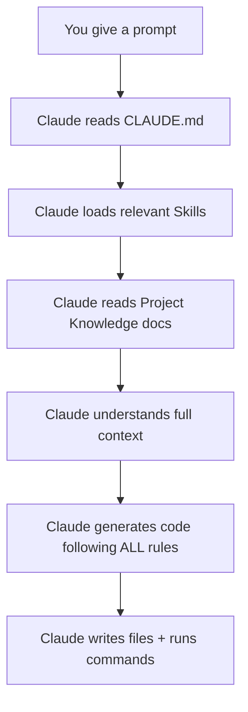

# 🚀 Complete Guide: Building QuikrClone with Claude — Features, Skills & Best Practices

> **Goal:** Use Claude's full feature set (CLAUDE.md, Skills, Project Knowledge, Custom Instructions) to efficiently build this classifieds platform with consistent, high-quality output.

---

## 📋 Table of Contents

1. [Claude Features Overview (For Manager Presentation)](#1-claude-features-overview)
2. [Files You Need to Create](#2-files-you-need-to-create)
3. [Step-by-Step Build Process](#3-step-by-step-build-process)
4. [Best Practices &amp; Tips](#4-best-practices--tips)

---

## 1. Claude Features Overview

> [!IMPORTANT]
> Use this section to explain Claude's capabilities to your manager.

### 1.1 What is Claude Code?

Claude Code is Anthropic's **agentic coding assistant** that runs in your terminal. Unlike ChatGPT or basic copilots, it can:

- Read/write files directly in your project
- Run terminal commands (npm, python, git, etc.)
- Understand your **entire codebase** at once
- Follow **project-specific rules** you define

### 1.2 Key Features Comparison

| Feature                          | What It Does                                                             | Why It Matters                                                              |
| -------------------------------- | ------------------------------------------------------------------------ | --------------------------------------------------------------------------- |
| **CLAUDE.md**              | Project-level instruction file Claude reads automatically                | Ensures consistent coding patterns across all sessions                      |
| **Skills (`.md` files)** | Reusable instruction sets for specific domains (frontend, backend, etc.) | Claude follows your exact architecture rules every time                     |
| **Project Knowledge**      | `.md` docs describing your full app functionality                      | Claude understands business logic without re-explaining                     |
| **Custom Instructions**    | Per-user preferences set via Claude settings                             | Personal coding style applied automatically                                 |
| **Multi-file Editing**     | Edit multiple files in one operation                                     | Build entire features (model → schema → crud → endpoint → UI) in one go |
| **Command Execution**      | Run shell commands directly                                              | Runs migrations, installs deps, starts servers                              |
| **Git Integration**        | Create commits, branches, PRs                                            | Full version control without leaving Claude                                 |

### 1.3 How Claude Processes Your Files



### 1.4 Manager Presentation Summary

> **"We use Claude Code to enforce coding standards automatically. Instead of writing a wiki that developers may ignore, we write `CLAUDE.md` and skill files that Claude reads EVERY time it generates code. This means:**
>
> - **Zero deviation** from our architecture (5-file module pattern)
> - **Consistent API responses** (`{success, msg, data}` format)
> - **Faster onboarding** — new devs just ask Claude to build features
> - **Self-documenting** — the skill files ARE the documentation"

---

## 2. Files You Need to Create

### 2.1 File Structure Overview

```
quikr_copy/
├── CLAUDE.md                          # 🔵 Master project rules (auto-loaded)
├── skills/                            # 🟢 Domain-specific instruction files
│   ├── frontend_rules.md              # React/Vite/Tailwind conventions
│   ├── backend_structure.md           # FastAPI module architecture
│   ├── database_rules.md              # SQLAlchemy + Alembic patterns
│   └── api_conventions.md             # API response format & auth rules
├── docs/                              # 🟡 Project knowledge / functionality
│   ├── project_overview.md            # Full app description & features
│   ├── modules_specification.md       # Each module's detailed requirements
│   ├── database_schema.md             # All tables, relationships, fields
│   └── ui_components.md               # Frontend component specifications
└── ... (project source code)
```

### 2.2 Detailed File Descriptions

| # | File                              | Purpose                                                | When Claude Uses It                 |
| - | --------------------------------- | ------------------------------------------------------ | ----------------------------------- |
| 1 | `CLAUDE.md`                     | Master rules — always loaded first                    | **Every single prompt**       |
| 2 | `skills/frontend_rules.md`      | React component patterns, styling, state management    | When working on `frontend/` files |
| 3 | `skills/backend_structure.md`   | FastAPI module pattern (model→schema→crud→endpoint) | When working on `backend/` files  |
| 4 | `skills/database_rules.md`      | SQLAlchemy models, migrations, relationships           | When creating/modifying models      |
| 5 | `skills/api_conventions.md`     | Response format, error handling, auth                  | When writing endpoints              |
| 6 | `docs/project_overview.md`      | What the app does, user flows                          | When planning new features          |
| 7 | `docs/modules_specification.md` | Detailed requirements per module                       | When building specific features     |
| 8 | `docs/database_schema.md`       | Complete DB schema reference                           | When designing data models          |
| 9 | `docs/ui_components.md`         | Component design specs                                 | When building UI components         |

---

## 3. Step-by-Step Build Process

### Phase 1: Create the CLAUDE.md (Master Rules File)

> [!IMPORTANT]
> This is the **most important file**. Claude reads it automatically at the start of every session. Keep it concise but comprehensive.

Create `CLAUDE.md` in your project root:

```markdown
# CLAUDE.md — QuikrClone Project

## Project Overview
QuikrClone is a classifieds platform (Quikr.com clone) built with:
- **Backend:** FastAPI + PostgreSQL + SQLAlchemy + Alembic
- **Frontend:** React 18 + Vite + Tailwind CSS + Lucide Icons
- **Auth:** JWT-based authentication
- **Real-time:** WebSocket chat

## Quick Commands
- Backend: `cd backend && uvicorn main:app --reload --port 8000`
- Frontend: `cd frontend && npm run dev`
- Migration: `cd backend && alembic revision --autogenerate -m "desc"`
- Apply Migration: `cd backend && alembic upgrade head`
- Dependencies: Backend uses `uv`, Frontend uses `npm`

## Architecture Rules
1. Backend follows modular pattern: `app/modules/<name>/` with 5 files
2. Every API returns: `{"success": bool, "msg": str, "data": any}`
3. Frontend uses functional components + hooks only
4. All models inherit `CommonModelMixin` (id, uuid, timestamps, soft-delete)
5. Email sending uses `app/utils/email.py` with Gmail SMTP (STARTTLS)
6. All email templates use a common branded HTML wrapper

## Skills
- Read `skills/frontend_rules.md` when working on frontend code
- Read `skills/backend_structure.md` when working on backend code
- Read `skills/database_rules.md` when creating models or migrations
- Read `skills/api_conventions.md` when writing API endpoints

## Project Docs
- `docs/project_overview.md` — Full feature list and user flows
- `docs/modules_specification.md` — Detailed module requirements
- `docs/database_schema.md` — Database schema reference
```

---

### Phase 2: Create Skill Files

#### File: `skills/frontend_rules.md`

```markdown
# Frontend Development Rules

## Tech Stack
- React 18 with Vite
- Tailwind CSS for styling
- Lucide React for icons
- React Router DOM v6 for routing
- Axios for API calls (configured in `src/api.js`)

## Component Rules
1. Use functional components with hooks — NO class components
2. File naming: PascalCase (e.g., `PostAd.jsx`, `SearchResults.jsx`)
3. One component per file
4. All components go in `frontend/src/components/`
5. Use AuthContext for authentication state

## State Management
- Use React Context for global state (auth, user data)
- Use useState/useReducer for local component state
- Use useEffect for data fetching on mount

## API Integration
- Always use the `api` instance from `src/api.js`
- Handle loading states with a `loading` state variable
- Handle errors with try/catch and show user-friendly messages
- Use toast notifications for success/error feedback

## Styling Conventions
- Use Tailwind utility classes
- Follow mobile-first responsive design
- Color palette: Use consistent brand colors
- Dark mode support via Tailwind dark: variants

## Component Template
```jsx
import React, { useState, useEffect } from 'react';
import { useAuth } from '../AuthContext';
import api from '../api';

export default function ComponentName() {
  const { user } = useAuth();
  const [data, setData] = useState([]);
  const [loading, setLoading] = useState(true);

  useEffect(() => {
    fetchData();
  }, []);

  const fetchData = async () => {
    try {
      setLoading(true);
      const res = await api.get('/endpoint/');
      if (res.data.success) {
        setData(res.data.data);
      }
    } catch (err) {
      console.error(err);
    } finally {
      setLoading(false);
    }
  };

  if (loading) return <div>Loading...</div>;

  return (
    <div className="container mx-auto px-4 py-8">
      {/* Component content */}
    </div>
  );
}
```

```

#### File: `skills/backend_structure.md`

```markdown
# Backend Structure Rules

## Module Pattern
Every backend feature lives in `backend/app/modules/<name>/` with exactly 5 files:

| File | Purpose |
|------|---------|
| `__init__.py` | Exports `router` and CRUD instance |
| `model.py` | SQLAlchemy model (inherits Base + CommonModelMixin) |
| `schema.py` | Pydantic request/response schemas |
| `crud.py` | Business logic (class-based, returns response dicts) |
| `endpoint.py` | FastAPI router (thin controller, delegates to CRUD) |

## When Creating a New Module
1. Create folder: `app/modules/<name>/`
2. Create all 5 files following the templates below
3. Register router in `app/api/v1/api.py`
4. Import model in `app/db/base.py`
5. Import model in `alembic/env.py`
6. Run: `alembic revision --autogenerate -m "add <name> table"`
7. Run: `alembic upgrade head`

## CRUD Class Template
- Class name: `{Entity}CRUD` (e.g., `AdCRUD`)
- Instance name: lowercase singular (e.g., `ad`)
- Every method returns: `{"success": bool, "msg": str, "data": any}`
- Catch SQLAlchemyError, always db.rollback() on error
- Use logging: `_logger = logging.getLogger(__name__)`

## Endpoint Template
- Use APIRouter()
- Inject `db: Session = Depends(get_db)`
- Inject `current_user = Depends(get_current_user)` for protected routes
- Wrap CRUD calls in try/except
- Use JSONResponse with status_code based on success/failure

## Naming Conventions
- Folders: lowercase plural (`users`, `ads`, `categories`)
- Models: singular PascalCase (`User`, `Ad`, `Category`)
- Tables: lowercase plural (`users`, `ads`, `categories`)
- Schemas: descriptive PascalCase (`CreateAdRequest`, `AdResponse`)
```

#### File: `skills/database_rules.md`

```markdown
# Database Rules

## Model Requirements
- Every model inherits `Base` and `CommonModelMixin`
- CommonModelMixin provides: id, uuid, created_at, modified_at, is_delete, deleted_at
- Use soft-delete (is_delete=True) instead of actual deletion
- Always add `index=True` on frequently queried columns

## Relationship Rules
- Use SQLAlchemy `relationship()` for ORM relations
- Always define `back_populates` on both sides
- Use `ForeignKey` with proper naming: `<table>.<column>`
- Cascade deletes where appropriate

## Migration Rules
- Always use autogenerate: `alembic revision --autogenerate -m "desc"`
- Review generated migration before applying
- Never edit migrations after they're applied
- Always test with `alembic upgrade head` after creating

## Query Patterns
- Filter soft-deleted: `.filter(Model.is_delete == False)`
- Pagination: `.offset(skip).limit(limit)`
- Count: Use `db.query(func.count(Model.id))`
- Always use `.first()` for single results, `.all()` for lists
```

#### File: `skills/api_conventions.md`

```markdown
# API Conventions

## Response Format (MANDATORY)
Every API response MUST follow:
```json
{"success": true/false, "msg": "Human message", "data": {}}
```

Paginated:

```json
{"success": true, "msg": "Fetched.", "data": [...], "total": 50, "skip": 0, "limit": 20}
```

## Auth Rules

- Public routes: No auth dependency
- Protected routes: `current_user = Depends(get_current_user)`
- Admin routes: `current_user = Depends(get_admin_user)`
- JWT token in header: `Authorization: Bearer <token>`

## URL Conventions

- Base: `/api/v1/`
- Module prefix: `/api/v1/<module>/` (e.g., `/api/v1/ads/`)
- CRUD endpoints: `create/`, `list/`, `get/{uuid}/`, `update/`, `delete/`
- Use trailing slashes

## Error Handling

- 200: Success
- 400: Bad request / validation / business logic error
- 401: Unauthorized
- 403: Forbidden (wrong role)
- 404: Not found
- 500: Internal server error (catch-all in endpoint)

```

---

### Phase 3: Create Project Knowledge Docs

#### File: `docs/project_overview.md`

> [!TIP]
> This file should describe WHAT the app does. Copy/adapt from your existing `quikr_full_analysis.md` but focus on what YOU are building (not all of Quikr).

```markdown
# QuikrClone — Project Overview

## What We're Building
A classifieds platform inspired by Quikr.com where users can:
- Post free classified ads (sell items, offer services)
- Browse/search ads by category, location, and keywords
- Chat with sellers in real-time (WebSocket)
- Save favorite ads
- Admin panel for managing categories, locations, FAQs, reports

## User Roles
1. **Guest** — Browse ads, search, view details
2. **Registered User** — Post ads, chat, favorites, profile
3. **Admin** — Manage categories, locations, FAQs, reports, knowledge base

## Core User Flows
1. Signup → Email verification → Login → JWT token
2. Browse homepage → Search/filter → View ad details → Chat with seller
3. Post ad → Select category → Fill details → Upload images → Publish
4. Admin login → Manage categories/locations/FAQs/reports

## Modules Built
- Users (auth, profile, email verification, password reset, change password)
- Ads (CRUD, images, similar ads)
- Categories (with dynamic attributes)
- Locations (hierarchical)
- Chat (real-time WebSocket)
- Chatbot (FAQ + RAG knowledge base)
- Favorites, Notifications, Search Alerts
- Reports, Reviews, Contact, Packages
- Recently Viewed (server-synced via DB)
- Email Flows (welcome, verify, forgot/reset password, change password)
- Wishlist Notifications (any ad update triggers notification)
```

#### File: `docs/modules_specification.md`

```markdown
# Module Specifications

## 1. Users Module
- Registration with email + password
- Email verification flow
- JWT login (access token)
- Profile management (name, phone, avatar)
- Admin role support

## 2. Ads Module
- Create ad: title, description, price, category, location, images
- List ads: with pagination, filters (category, location, price range)
- Search: full-text search across title + description
- Similar ads: recommend based on category + price proximity
- Image upload: multiple images per ad
- My Ads: user's own listings management

## 3. Categories Module
- Hierarchical: parent → sub-category
- Dynamic attributes per category (e.g., "Brand" for Mobiles)
- Admin CRUD for categories
- Seed data for initial categories

## 4. Locations Module
- Hierarchical: state → city → locality
- Admin CRUD
- Used in ad posting and search filters

## 5. Chat Module
- Real-time WebSocket messaging
- Buyer-seller conversations linked to ads
- Message history persistence
- Unread message count

## 6. Chatbot Module
- FAQ-based auto-responses
- Knowledge base with pgvector RAG
- Drag-and-drop document ingestion (admin)

## 7. Supporting Modules
- **Favorites:** Save/unsave ads, list favorites
- **Notifications:** System notifications for users (wishlist updates, price changes, general ad edits)
- **Search Alerts:** Save search criteria, alert on new matches
- **Reports:** Report inappropriate ads
- **Reviews:** Rate sellers
- **Contact:** Contact form submissions
- **Packages:** Premium ad packages/pricing
- **Recently Viewed:** Server-synced browsing history (PostgreSQL), 20-ad cap

## 8. Email System
- SMTP via Gmail (STARTTLS on port 587)
- **Welcome Email:** Auto-sent after signup
- **Email Verification:** Token-based (24hr expiry), auto-sent on signup + manual trigger from Profile
- **Forgot Password:** Generates 1hr reset token, emails reset link (prevents email enumeration)
- **Reset Password:** Validates token + token_version, sets new password, invalidates old tokens
- **Change Password:** Authenticated flow, verifies old password, sends confirmation email
- **Wishlist Notifications:** When any favorited ad is updated, all interested users get notified
- All emails use branded HTML templates with consistent QuikrClone branding
```

---

### Phase 4: Build Process (How to Use These Files with Claude)

> [!IMPORTANT]
> This is the actual workflow for day-to-day development with Claude.

#### Step 1: Initialize Project with Claude

```
Prompt to Claude:
"Read CLAUDE.md and all files in skills/ and docs/ folders.
Set up a fresh project with:
- Backend: FastAPI with the module structure from skills/backend_structure.md
- Frontend: React + Vite with rules from skills/frontend_rules.md
- Database: PostgreSQL with rules from skills/database_rules.md
Start with the Users module (auth + profile)."
```

#### Step 2: Build Module by Module

```
Prompt to Claude:
"Following the backend structure in skills/backend_structure.md,
create the Ads module with these features from docs/modules_specification.md:
- Create ad with images
- List with pagination and filters
- Search by keyword
- Similar ads recommendation
Make sure to register in all 3 places and run migration."
```

#### Step 3: Build Frontend Components

```
Prompt to Claude:
"Following skills/frontend_rules.md, build the HomePage component:
- Category grid from docs/ui_components.md
- Recent ads carousel
- Search bar with location filter
- Connect to backend APIs using src/api.js patterns"
```

#### Step 4: Iterate and Fix

```
Prompt to Claude:
"The chat WebSocket connection drops after 30 seconds.
Check skills/backend_structure.md for error handling patterns.
Fix the Chat module's WebSocket endpoint and frontend component."
```

---

## 4. Best Practices & Tips

### 4.1 CLAUDE.md Best Practices

| Do ✅                            | Don't ❌                             |
| -------------------------------- | ------------------------------------ |
| Keep it under 100 lines          | Write a novel                        |
| Include exact commands           | Assume Claude knows your setup       |
| Reference skill files            | Duplicate skill content in CLAUDE.md |
| Update when architecture changes | Let it go stale                      |
| Include folder structure         | List every single file               |

### 4.2 Skills File Best Practices

| Do ✅                               | Don't ❌                       |
| ----------------------------------- | ------------------------------ |
| Include code templates              | Write abstract theory          |
| One domain per skill file           | Mix frontend + backend rules   |
| Show exact patterns to follow       | Leave rules ambiguous          |
| Include naming conventions          | Assume Claude knows your style |
| Update after architecture decisions | Create and forget              |

### 4.3 Prompting Best Practices

| Strategy                           | Example                                                         |
| ---------------------------------- | --------------------------------------------------------------- |
| **Reference your files**     | "Follow `skills/backend_structure.md` to create..."           |
| **Be specific about module** | "Build the Favorites module with save/unsave/list"              |
| **Ask for full feature**     | "Create model, schema, crud, endpoint, AND the React component" |
| **Request registration**     | "Register in api.py, base.py, and alembic/env.py"               |
| **Ask for migration**        | "Run the migration after creating the model"                    |

### 4.4 Workflow Order for Building This Project

```
Phase 1: Foundation
  1. Create CLAUDE.md
  2. Create all skill files
  3. Create project knowledge docs
  4. Initialize backend (FastAPI + DB + Alembic)
  5. Initialize frontend (Vite + React + Tailwind)

Phase 2: Core Backend (module by module)
  6. Users module (auth + JWT + profile)
  7. Categories module (hierarchical + attributes)
  8. Locations module (state → city → locality)
  9. Ads module (CRUD + images + search)
  10. Favorites module
  11. Chat module (WebSocket)

Phase 3: Frontend (component by component)
  12. Layout (Navbar + Footer + routing)
  13. Auth pages (Login, Signup, Verify)
  14. HomePage (categories + recent ads + search)
  15. SearchResults (filters + pagination)
  16. AdDetails (gallery + seller info + chat)
  17. PostAd (form + image upload)
  18. Profile + MyAds
  19. Chat component

Phase 4: Advanced Features
  20. Chatbot + FAQ
  21. Knowledge Base (RAG)
  22. Notifications + Search Alerts
  23. Admin Panel
  24. Reports + Reviews
  25. Recently Viewed (server-synced)
  26. Wishlist Change Notifications
  27. Email Flows (welcome, verify, forgot/reset/change password)

Phase 5: Polish
  28. Responsive design
  29. Error handling
  30. Performance optimization
  31. Testing
```

### 4.5 Claude Code CLI Commands to Know

```bash
# Start Claude Code in your project
claude

# Start with a specific task
claude "Read CLAUDE.md and create the Ads module"

# Continue a previous conversation
claude --continue

# Resume the most recent conversation
claude --resume
```

### 4.6 How Claude Reads Files (Priority Order)

```
1. CLAUDE.md (root)          → Always loaded first, automatically
2. CLAUDE.md (subdirectories) → Loaded when working in that directory
3. Skills files              → Loaded when you reference them OR Claude decides they're relevant
4. Project docs              → Loaded when planning features
5. Source code               → Read on-demand as needed
```

---

## 5. Quick Reference Card

### Files to Create FIRST (Before Any Coding)

| Priority | File                              | Lines  | Time   |
| -------- | --------------------------------- | ------ | ------ |
| 🔴 P0    | `CLAUDE.md`                     | ~50-80 | 30 min |
| 🟠 P1    | `skills/backend_structure.md`   | ~80    | 20 min |
| 🟠 P1    | `skills/frontend_rules.md`      | ~60    | 20 min |
| 🟡 P2    | `skills/database_rules.md`      | ~40    | 15 min |
| 🟡 P2    | `skills/api_conventions.md`     | ~40    | 15 min |
| 🟢 P3    | `docs/project_overview.md`      | ~60    | 20 min |
| 🟢 P3    | `docs/modules_specification.md` | ~100   | 30 min |

**Total setup time: ~2.5 hours** → Saves 10x that in development time.

Example Prompt Flow

```
Session 1: "Read all files. Set up backend skeleton with Users module."
Session 2: "Build Categories and Locations modules following backend rules."
Session 3: "Build Ads module with search and image upload."
Session 4: "Set up frontend with routing. Build Navbar, Footer, HomePage."
Session 5: "Build SearchResults and AdDetails pages."
Session 6: "Build Chat with WebSocket."
Session 7: "Build Admin panel."
Session 8: "Polish, test, and fix bugs."
```

---

> [!TIP]
> **Key Insight:** The skill files are NOT just documentation — they are **executable instructions** that Claude follows literally. The better your skill files, the less you need to explain in each prompt. Think of them as "programming Claude" itself.
